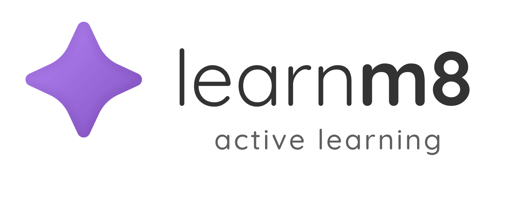
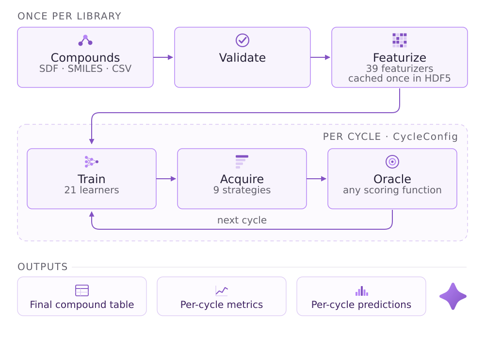

<div align="center">
  <picture>
    <source media="(prefers-color-scheme: dark)" srcset="media/learnm8_white_full.png">
    
  </picture>
  <br><br>
  <strong>Active Learning Framework for Molecular Screening</strong>
  <br><br>

[](https://drugm8.github.io/LearnM8/)
[](https://www.python.org/downloads/)
[](LICENSE)

</div>

LearnM8 is a comprehensive active learning framework for molecular property prediction and compound screening. It combines state-of-the-art machine learning models with sophisticated acquisition strategies to enable efficient exploration of chemical space.

Built on a pure functional architecture, LearnM8 provides explicit cycle control, comprehensive uncertainty quantification, and molecular-specific optimizations. The framework supports both benchmark analysis (with known ground truth) and production screening (with expensive experimental measurements), making it suitable for both research and real-world drug discovery applications.

**Key Capabilities:** 21 ML models (including Chemprop GNNs, ensembles, and CUDA-accelerated learners), 9 acquisition strategies, 39 featurizers (30 2D + 9 3D), HDF5 caching for ~100× speedup, automatic parallelization, GPU acceleration via GPyTorch and RAPIDS cuML, and design space pruning for large-scale screening.

## 🏗️ Architecture



A run is a loop: featurize the pool once into an HDF5 cache, train a learner on
what is labeled, predict over what is not, let an acquisition strategy pick the
next batch, measure it with an oracle, repeat. Cycle 0 is a random seed batch with
no model; cycles 1–N are the active learning proper.

## 📚 Documentation

**📖 [https://drugm8.github.io/LearnM8](https://drugm8.github.io/LearnM8/)**

- [Installation Guide](https://drugm8.github.io/LearnM8/getting-started/installation/)
- [Quickstart Tutorial](https://drugm8.github.io/LearnM8/getting-started/quickstart/)
- [Core Concepts](https://drugm8.github.io/LearnM8/getting-started/concepts/)
- [CLI Reference](https://drugm8.github.io/LearnM8/user-guide/cli-reference/)
- [API Reference](https://drugm8.github.io/LearnM8/user-guide/api-reference/)
- [Learners](https://drugm8.github.io/LearnM8/components/learners/overview/) | [Acquisition](https://drugm8.github.io/LearnM8/components/acquisition/overview/) | [Featurizers](https://drugm8.github.io/LearnM8/components/featurizers/overview/)

## 🚀 Quick Start

### Installation

```bash
conda env create -f environment.yml
conda activate learnm8
pip install -e .
```

### Your First Experiment

**Python API:**

```python
from learnm8 import run_active_learning

# Oracle auto-detected from companion CSV (benchmark mode)
results = run_active_learning(
    compound_pool='compounds.csv',
    learner='gp',
    target_col='Activity',
    featurizer='morgan',
    n_cycles=10
)

# Explicit oracle, non-standard column names
results = run_active_learning(
    compound_pool='compounds.csv',
    oracle='oracle.csv',
    learner='gp',
    target_col='Activity',
    featurizer='morgan',
    n_cycles=10,
    smiles_column='Smiles',
    id_column='CompoundID'
)
```

**CLI Alternative:**

```bash
learnm8 validate compounds.csv
learnm8 run compounds.csv --target Activity --learner gp --featurizer morgan --n-cycles 10

# Non-standard column names
learnm8 run compounds.csv --target Activity --learner gp --featurizer morgan \
  --smiles-col Smiles --id-col CompoundID

# GPU + parallelism control
learnm8 run compounds.csv --target Activity --learner chemprop \
  --device cuda --n-jobs 8
```

## 📖 Examples

Learn LearnM8 through hands-on examples:

**Notebooks:** ([examples/notebooks/](examples/notebooks/))

- [Quickstart](examples/notebooks/01_quickstart.ipynb) (10 min): First active learning experiment (benchmark mode)
- [Custom Oracles](examples/notebooks/02_custom_oracles.ipynb) (15 min): Custom oracles in production (run mode)
- [Advanced Configuration](examples/notebooks/03_advanced_configuration.ipynb) (15 min): Custom learners and multi-stage workflows
- [Production Screening](examples/notebooks/04_production_screening.ipynb) (20 min): Real-world deployment

**Example Oracles:** ([examples/oracles/](examples/oracles/))

- `SimilarityOracle`: 2D fingerprint-based similarity
- `Pharmacophore2DOracle`: Functional group pattern matching
- `CDPKitPharmacophoreOracle`: 3D pharmacophore alignment (requires CDPKit)
- `VinaOracle`: Molecular docking (requires Vina)

See [examples/README.md](examples/README.md) for complete guide.

## 📊 Components Overview

| Component       | Count | Examples                                                                                                                                                                                                        |
| --------------- | ----- | --------------------------------------------------------------------------------------------------------------------------------------------------------------------------------------------------------------- |
| **Learners**    | 21    | rf, gp, gpu_gp, svgp, xgb, lr, dt, mlp, mc_dropout, fastprop, chemprop, rf_fil, ridge_cuml, chemprop_ensemble, rf_ensemble, lr_ensemble, xgb_ensemble, dt_ensemble, mixed_ensemble, fastprop_ensemble, ensemble |
| **Acquisition** | 9     | greedy, random, topk, ucb, ei, pi, thompson, entropy, simulated_annealing                                                                                                                                       |
| **Featurizers** | 39    | 30 2D + 9 3D (38 unique; see categories below)                                                                                                                                                                  |
| **Pruning**     | 1     | score                                                                                                                                                                                                           |

### Learners

Pool size reflects the total compound pool. GP is limited by labeled set growth (O(n³) training). Neural models benefit significantly from GPU for larger pools. GPU learners require CUDA-capable hardware and optional dependencies (GPyTorch, RAPIDS cuML).

| Shortcut            | Class                       | Uncertainty Method        | CPU | GPU | CPU Pool Size | GPU Pool Size |
| ------------------- | --------------------------- | ------------------------- | --- | --- | ------------- | ------------- |
| `rf`                | `RandomForestLearner`       | Tree std dev              | ✓   | —   | 1K – 10M+     | —             |
| `gp`                | `GaussianProcessLearner`    | GP posterior variance     | ✓   | —   | < 10K         | —             |
| `gpu_gp`            | `GPUGaussianProcessLearner` | GP posterior variance     | ✓   | ✓   | < 10K         | < 10K         |
| `svgp`              | `SVGPLearner`               | Variational posterior     | ✓   | ✓   | < 10K         | 10K – 100K+   |
| `xgb`               | `XGBoostLearner`            | None                      | ✓   | ✓   | 1K – 10M+     | 1K – 10M+     |
| `lr`                | `LinearRegressionLearner`   | Leverage-based analytical | ✓   | —   | any size      | —             |
| `dt`                | `DecisionTreeLearner`       | Leaf impurity             | ✓   | —   | 1K – 10M+     | —             |
| `mlp`               | `MLPLearner`                | None                      | ✓   | ✓   | 10K – 100K    | 10K – 1M+     |
| `mc_dropout`        | `MCDropoutLearner`          | MC Dropout sampling       | ✓   | ✓   | 5K – 50K      | 5K – 500K     |
| `fastprop`          | `FastpropLearner`           | None                      | ✓   | ✓   | 10K – 100K    | 10K – 1M+     |
| `chemprop`          | `ChempropLearner`           | None                      | ✓   | ✓   | 5K – 50K      | 5K – 500K     |
| `rf_fil`            | `RfFilLearner`              | Per-tree std dev          | —   | ✓   | —             | 1K – 10M+     |
| `ridge_cuml`        | `RidgeCumlLearner`          | Leverage-based analytical | —   | ✓   | —             | any size      |
| `chemprop_ensemble` | `ChempropEnsemble`          | Ensemble std dev          | ✓   | ✓   | 1K – 20K      | 1K – 200K     |
| `rf_ensemble`       | `RFEnsemble`                | Ensemble std dev          | ✓   | —   | 1K – 10M+     | —             |
| `lr_ensemble`       | `LREnsemble`                | Ensemble std dev          | ✓   | ✓   | any size      | any size      |
| `xgb_ensemble`      | `XGBEnsemble`               | Ensemble std dev          | ✓   | ✓   | 1K – 10M+     | 1K – 10M+     |
| `dt_ensemble`       | `DTEnsemble`                | Ensemble std dev          | ✓   | —   | 1K – 10M+     | —             |
| `mixed_ensemble`    | `MixedEnsemble`             | Ensemble std dev          | ✓   | ✓   | 1K – 50K      | 1K – 50K      |
| `fastprop_ensemble` | `FastpropEnsemble`          | Ensemble std dev          | ✓   | ✓   | 5K – 50K      | 5K – 500K     |
| `ensemble`          | `EnsembleLearner`           | Ensemble std dev          | ✓   | —   | 1K – 100K     | —             |

### Acquisition Strategies

| Shortcut              | Class                               | Requires Uncertainty | Key Parameter                      | Strategy                                                                              |
| --------------------- | ----------------------------------- | -------------------- | ---------------------------------- | ------------------------------------------------------------------------------------- |
| `greedy`              | `GreedyAcquisition`                 | No                   | `score_direction`                  | Pure exploitation — selects compounds with highest predicted values                   |
| `random`              | `RandomAcquisition`                 | No                   | `random_state`                     | Random selection — baseline for evaluating other strategies                           |
| `topk`                | `TopKAcquisition`                   | No                   | `k_fraction` (0.1)                 | Rank-ordered selection from configurable top/bottom fraction                          |
| `ucb`                 | `UCBAcquisition`                    | Yes                  | `beta` (2.0)                       | Exploitation + exploration via `mean + β × uncertainty`; higher β = more exploration  |
| `ei`                  | `ExpectedImprovementAcquisition`    | Yes                  | `xi` (0.01)                        | Expected improvement over current best; principled exploitation/exploration trade-off |
| `pi`                  | `ProbabilityImprovementAcquisition` | Yes                  | `xi` (0.01)                        | Probability of improving over current best; more conservative than EI                 |
| `thompson`            | `ThompsonSamplingAcquisition`       | Yes                  | `random_state`                     | Stochastic — samples from posterior predictive distribution                           |
| `entropy`             | `EntropyAcquisition`                | Yes                  | `entropy_type`                     | Maximum information gain — selects most uncertain compounds                           |
| `simulated_annealing` | `SimulatedAnnealingAcquisition`     | No                   | `initial_temp`, `cooling_schedule` | Temperature-based probabilistic selection; starts random, cools to greedy             |

**Uncertainty-based strategies** (`ucb`, `ei`, `pi`, `thompson`, `entropy`) require a learner that supports uncertainty. See the Learners table above — the **Uncertainty Method** column indicates compatibility.

Uncertainty computation is automatically skipped when the active strategy does not require it, reducing cycle time for skip-eligible learners (RF, GP, LR, DT, and GPU equivalents).

### Featurizers by Category

| Category               | Count | Names                                                                                                                                 |
| ---------------------- | ----- | ------------------------------------------------------------------------------------------------------------------------------------- |
| **2D Circular**        | 5     | morgan, ecfp, ecfp6, morgan_feat, secfp                                                                                               |
| **2D Structural Keys** | 4     | maccs, pubchem, klekota_roth, laggner                                                                                                 |
| **2D Topological**     | 6     | avalon, atom_pair, topological_torsion, rdkit, pattern, layered                                                                       |
| **2D Hashed**          | 4     | map4, mhfp, lingo, erg                                                                                                                |
| **2D Descriptors**     | 10    | mordred/descriptors, rdkit_2d_descriptors, estate, ghose_crippen, mqns, vsa, bcut2d, physiochemical, pharmacophore, functional_groups |
| **3D** (conformer)     | 9     | whim, usr, usrcat, e3fp, getaway, morse, rdf, autocorr, electroshape                                                                  |

See the [documentation](docs/) for complete details on all components.

## ⚡ CUDA Acceleration

LearnM8 supports GPU acceleration for training and inference via CUDA. GPU learners are optional — dependencies are lazy-imported and only required when a GPU learner is selected.

### GPU Gaussian Process (`gpu_gp`)

GPyTorch-based Exact GP with LOVE (Low-Rank Orthogonal Variance Estimation) for fast variance computation. Auto-selects Tanimoto kernel for binary fingerprints (via GAUCHE) or RBF for continuous features. LOVE-enabled variance is **12–96x faster** than naive GP at pool sizes ≥10K.

```python
results = run_active_learning(
    compound_pool='compounds.csv', target_col='Activity',
    learner='gpu_gp', featurizer='morgan', n_cycles=10, device='cuda'
)
```

**Requires:** GPyTorch ≥1.11, GAUCHE ≥0.1.6 (for Tanimoto kernel)

### Scalable Variational GP (`svgp`)

Stochastic Variational GP for datasets beyond the 10K limit of Exact GP. Uses inducing-point approximation with minibatch SGD — memory is O(M²) independent of training set size.

```python
results = run_active_learning(
    compound_pool='compounds.csv', target_col='Activity',
    learner='svgp', featurizer='morgan', n_cycles=10, device='cuda'
)
```

**Requires:** GPyTorch ≥1.11, GAUCHE ≥0.1.6

### RF FIL (`rf_fil`)

Trains a standard sklearn RandomForest on CPU, then converts the fitted forest to RAPIDS cuML Forest Inference Library (FIL) for GPU-accelerated batch inference. Provides uncertainty via per-tree prediction std dev.

```python
results = run_active_learning(
    compound_pool='compounds.csv', target_col='Activity',
    learner='rf_fil', featurizer='morgan', n_cycles=10
)
```

**Requires:** RAPIDS cuML ≥25.04, Treelite ≥4.6

### Ridge cuML (`ridge_cuml`)

GPU-accelerated Ridge regression via RAPIDS cuML with leverage-based uncertainty estimation. Gram matrix Cholesky computed on CPU (float64) with optional GPU leverage via CuPy.

**Requires:** RAPIDS cuML ≥25.04, CuPy (optional, for GPU leverage)

### GPU-Accelerated Ensembles

Several ensemble learners automatically use GPU backends when `device='cuda'`:

| Ensemble         | CPU Members       | GPU Members (`device='cuda'`)      |
| ---------------- | ----------------- | ---------------------------------- |
| `mixed_ensemble` | RF + LR + XGBoost | RF FIL + Ridge cuML + XGBoost CUDA |
| `xgb_ensemble`   | XGBoost CPU       | XGBoost CUDA                       |
| `lr_ensemble`    | LinearRegression  | Ridge cuML                         |

### Device Configuration

All learners accept a `device` parameter (`'auto'`, `'cpu'`, `'cuda'`, `'cuda:N'`). When set to `'auto'` (default), CUDA is used if available.

```bash
# CLI with GPU
learnm8 run compounds.csv --target Activity --learner gpu_gp --device cuda

# CLI with specific GPU
learnm8 run compounds.csv --target Activity --learner rf_fil --device cuda:0
```

GPU learners include automatic OOM recovery — training falls back to CPU when GPU memory is exceeded.

## 🔗 Links

- **Documentation:** [docs/](docs/index.md)
- **Tutorials:** [Running Experiments](docs/tutorials/running-experiments.md) | [Custom Cycles](docs/tutorials/building-custom-cycles.md) | [Advanced Workflows](docs/tutorials/advanced-workflows.md)
- **Customization:** [Custom Learners](docs/customization/custom-learners.md) | [Custom Acquisition](docs/customization/custom-acquisition.md)
- **Examples:** See [docs/tutorials/](docs/tutorials/) for comprehensive examples

## 🤝 Contributing

Contributions are welcome! LearnM8 follows a functional architecture with modular design. When contributing:

1. Maintain pure functional patterns
2. Use Polars for all internal DataFrame operations
3. Follow existing code conventions
4. Add comprehensive tests with real molecular data
5. Update documentation for new features

See the [extending framework guide](docs/customization/extending-framework.md) for details on adding new components.

## 📄 License

LearnM8 is developed for molecular screening and active learning research.

## 📚 Citation

If you use LearnM8 in your research, please cite our work (citation details to be added).

## 🧪 Testing

```bash
pytest -m "not slow" tests/                          # Fast tests only (~1295 tests)
pytest tests/                                         # All tests including slow
pytest tests/ --cov=learnm8 --cov-fail-under=90      # Coverage (minimum 90%)
```

---

**LearnM8**: Intelligent molecular screening through active learning 🧬🤖
